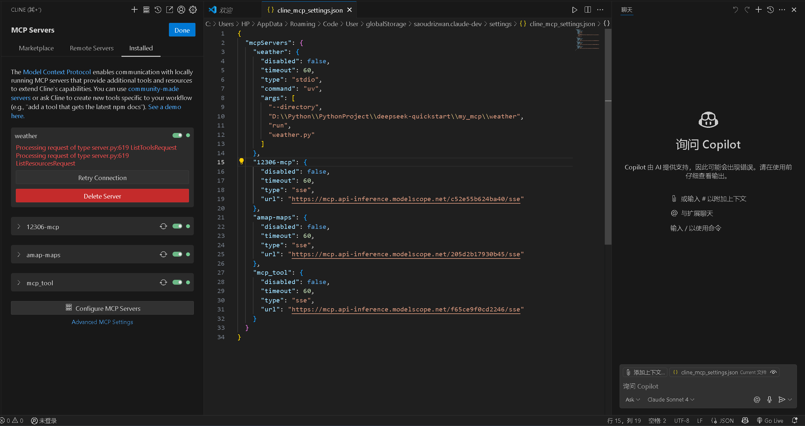
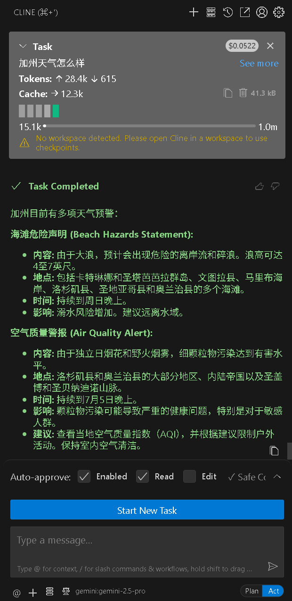
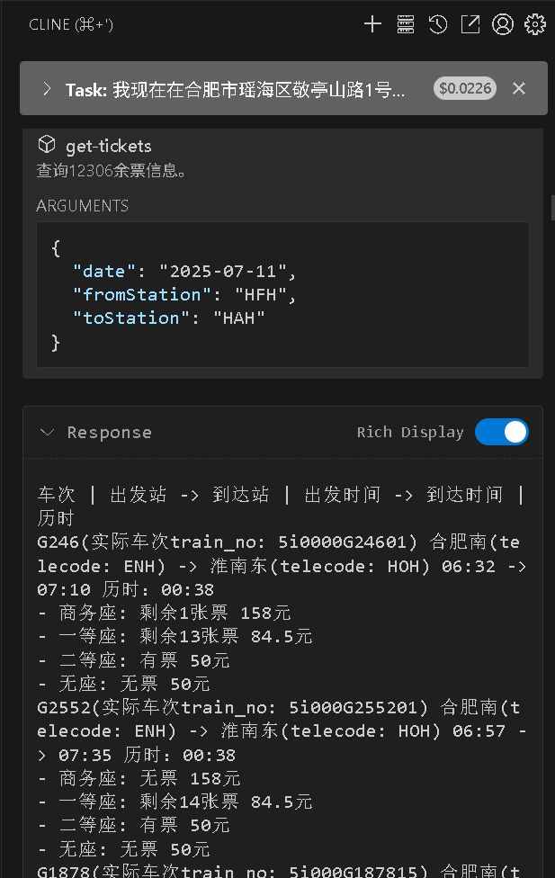

# MCP实践

## uv创建环境

```powershell
powershell -ExecutionPolicy ByPass -c "irm https://astral.sh/uv/install.ps1 | iex"
# 如果电脑里有多个环境，需要指定Python解释器路径
uv init weather -p "C:\ProgramData\anaconda3\envs\Python3_12\python.exe"
cd weather
# 创建并激活虚拟环境 (用于隔离项目依赖）
uv venv
.venv\Scripts\activate 
# 安装项目所需的依赖包
uv add mcp[cli] httpx
# 创建 MCP 服务器代码文件
new-item weather.py
```

## CLINE配置


```json
{
  "mcpServers": {
    "weather": {
      "disabled": false,
      "timeout": 60,
      "type": "stdio",
      "command": "uv",
      "args": [
        "--directory",
        "D:\\Python\\PythonProject\\deepseek-quickstart\\my_mcp\\weather",
        "run",
        "weather.py"
      ]
    },
    "12306-mcp": {
      "disabled": false,
      "timeout": 60,
      "type": "sse",
      "url": "https://mcp.api-inference.modelscope.net/c52e55b624ba40/sse"
    },
    "amap-maps": {
      "disabled": false,
      "timeout": 60,
      "type": "sse",
      "url": "https://mcp.api-inference.modelscope.net/205d2b17930b45/sse"
    },
    "mcp_tool": {
      "disabled": false,
      "timeout": 60,
      "type": "sse",
      "url": "https://mcp.api-inference.modelscope.net/f65ce9f0cd2246/sse"
    }
  }
}
```

## 运行效果


